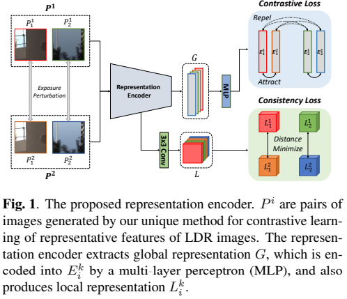
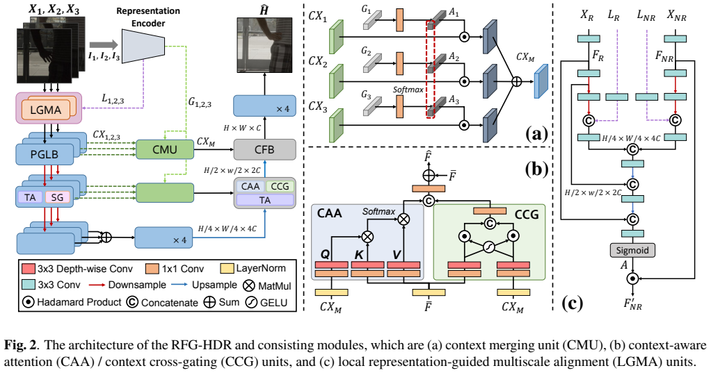

# RFG-HDR
# Representative Feature-guided Transformer for Multi-exposure High Dynamic Range Imaging (ICIP 2024) [[PDF](https://ieeexplore.ieee.org/document/10647362)]

Keuntek Lee, Jaehyun Park, Gu Yong Park, Nam Ik Cho

## Abstract (RFG-HDR)

Multi-exposure fusion is a high dynamic range (HDR) imaging technique that combines multiple low dynamic range (LDR) images of a scene with varying exposure times to produce a single high-quality HDR image. Since each LDR frame is captured with a different exposure time (bias), it is crucial to extract meaningful features from each differentlyexposed LDR frame for producing high-quality HDR images. This paper introduces a new contrastive learning method that provides a versatile way of extracting characteristic features from LDR frames by considering the relationship between LDR frames. Additionally, we introduce Representative Feature-Guided Transformer (RFGHDR), a new architecture that utilizes contrastive-learned representations to improve frame alignment and merging. Based on extensive experiments on various datasets, we have found that the RFG-HDR performs better than existing multi-exposure HDR imaging methods in terms of various evaluation metrics
<br><br>

## <u>Representation Encoder</u>

<p align="center"></p>

## <u>Reconstruction Network</u>

<p align="center"></p>

## Experimental Results


<p align="center"></p>


### Test

```
python test_RFGViT.py
```

## Citation

```
@inproceedings{lee2024rfg,
  title={RFG-HDR: Representative Feature-Guided Transformer For Multi-Exposure High Dynamic Range Imaging},
  author={Lee, Keuntek and Park, Jaehyun and Park, Gu Yong and Cho, Nam Ik},
  booktitle={2024 IEEE International Conference on Image Processing (ICIP)},
  pages={1521--1527},
  year={2024},
  organization={IEEE}
}
```
